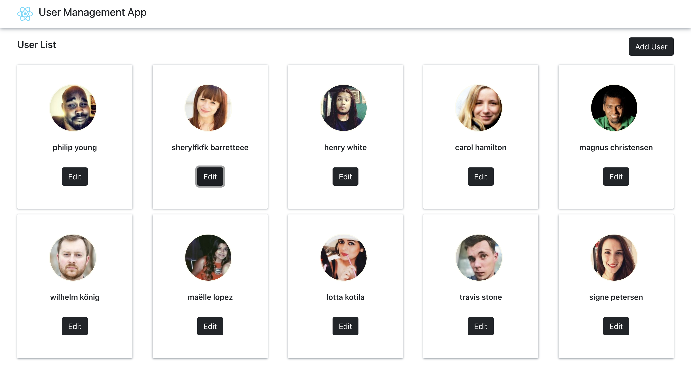

# User Management App
User Management App is a simple react application that allows to list, add, update and remove users.

The associated backend api is provided from this [link](https://github.com/Besedo/frontend-test-data)

## Overview



## Getting started
1. Download or clone the application repository from this [link](https://github.com/aitdahane/user-management-app)
2. In case you download the project, unzip the file
4. Launch the backend by following the steps in this [link](https://github.com/Besedo/frontend-test-data)
3. Go the project folder then run the following commands:
```
   yarn install --frozen-lockfile
   yarn start
```
4. Open [http://localhost:3000](http://localhost:3000) in the browser to view the page.

## Files Structure
```
.
├── public
├── src 
    ├── api
        ├── ApiAdapter.ts
        ├── UserApiAdapter.ts
    ├── assets
    ├── components
        ├── Header
        ├── UserCard
        ├── UserEdit
        ├── UserList
    ├── helpers
        ├── UserHelper.test.ts
        ├── UserHelper.ts
    ├── types
        ├── User.ts
        ├── Name.ts
    ├── App.css
    ├── App.tsx               
├── LICENSE
└── README.md

```

## Tests
In order to Launch the tests, run the command:
```
yarn test
```

If you want to run a specific test file, you can use :
```
yarn test src/App.test.tsx 
```

## License

[MIT License](./LICENSE)